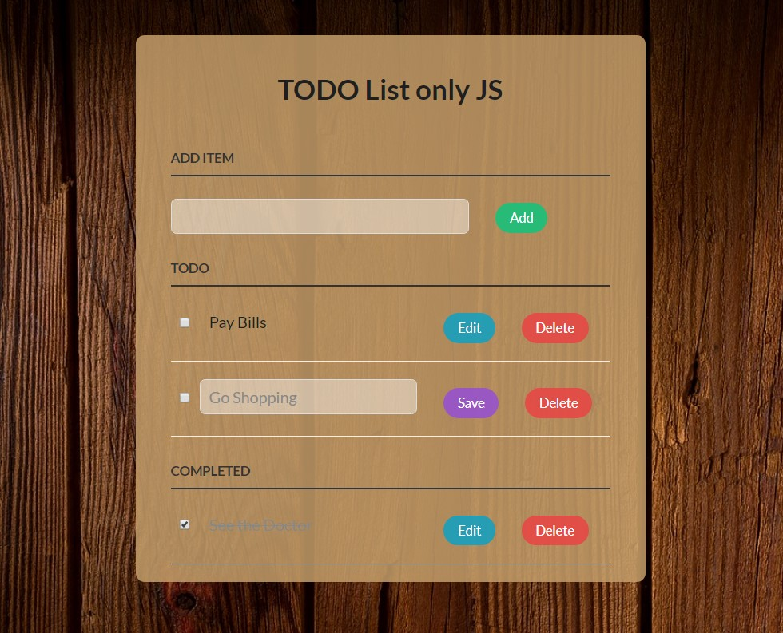

Basic JavaScript ToDo App
======
Vanilla (**JavaScript**)-only

#### Screenshot

Check out the <a href="https://juanjotorres.net/projects/todolistjs/" target="_blank">Demo</a>.

Added new features:
 - Color buttons for every state.
 - Add todo list items on submit as well.
 - New styling.
 - Future implementation of LocalStorage.

## Synopsis

Just a basic todo app that I wrote using vanilla **JavaScript** so there's not much to it.

## License

Copyright (c) 2015 Bartek Kus

Licensed under the MIT license
